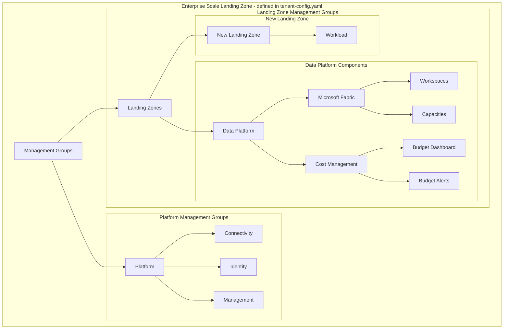

# Azure Landing Zone - Data Platform Deployment

[](https://github.com/tnhtnh/alz-platform/actions)
[](https://github.com/tnhtnh/alz-platform/actions)

This project implements a specialized Data Platform Landing Zone within the Azure Landing Zone framework, focusing on Microsoft Fabric workloads with integrated cost management and security controls.

## Architecture Overview



## Features
* *Microsoft Fabric Focus*: Specialized landing zone for Microsoft Fabric workloads
* *Cost Control*:
  * Integrated cost management dashboard
  * Multi-threshold budget alerts (50%, 75%, 90%, 100%)
  * Monthly budget tracking and reporting
* *Security & Governance*:
  * Strict resource type controls
  * Geographic boundary enforcement
  * Network security policies
* *Automated Deployment*:
  * Infrastructure as Code using Terraform
  * CI/CD pipelines for reliable deployments
  * Configuration validation


## Prerequisites
* Azure Subscription with Owner permissions
* Azure CLI (version 2.50.0 or higher)
* Terraform (version ~> 1.8)
* GitHub Actions (for CI/CD)

## Getting Started

### Making Changes to the Configuration

1. Clone the repository:
   ```bash
   git clone https://github.com/tnhtnh/alz-platform.git
   cd alz-platform
   ```

2. Create a new branch for your changes:
   ```bash
   git checkout -b feature/your-feature-name
   ```

3. Open and edit the `tenant-config.yaml` file to make your desired changes.

4. Commit your changes:
   ```bash
   git add tenant-config.yaml
   git commit -m "Description of your changes"
   ```

5. Push your branch to the remote repository:
   ```bash
   git push origin feature/your-feature-name
   ```

6. Open a Pull Request (PR) on GitHub for review and integration.

### Setting Up the Environment

1. Ensure you have met all the prerequisites listed above.
2. Run the setup script:
   ```bash
   ./setup.sh
   ```
3. Follow the prompts to configure your Azure environment and authenticate.

For detailed setup instructions, refer to the [Setup Guide](docs/setup-guide.md).

## Custodianship
| Role | Responsibility | Contact |
|------|----------------|---------|
| Platform Owner | Overall platform architecture and strategy | @platform-team |
| Security Owner | Security policies and compliance | @security-team |
| Cost Management | Budget monitoring and optimization | @finance-team |
