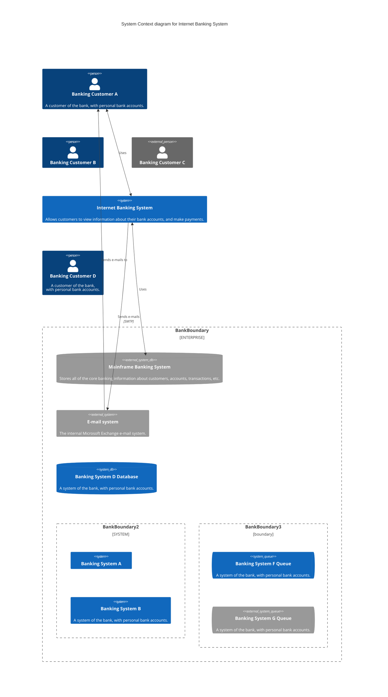

# Azure Landing Zone Deployment

This project deploys the default Azure Landing Zone.

## Overview

The Azure Landing Zone is a foundational set of cloud infrastructure components designed to ensure a secure and scalable environment for your Azure resources. This deployment uses the default configuration to set up a standardized landing zone.

## Features

- Deploys the default Azure Landing Zone configuration
- Establishes a well-structured, secure foundation for Azure resources
- Implements best practices for governance, security, and compliance

## Prerequisites

- Azure subscription
- Azure CLI or Azure PowerShell
- Necessary permissions to create resources in your Azure subscription

## Deployment

[Include specific deployment instructions here]

## Contributing

[Add contribution guidelines if applicable]

## License

[Specify the license for your project]

