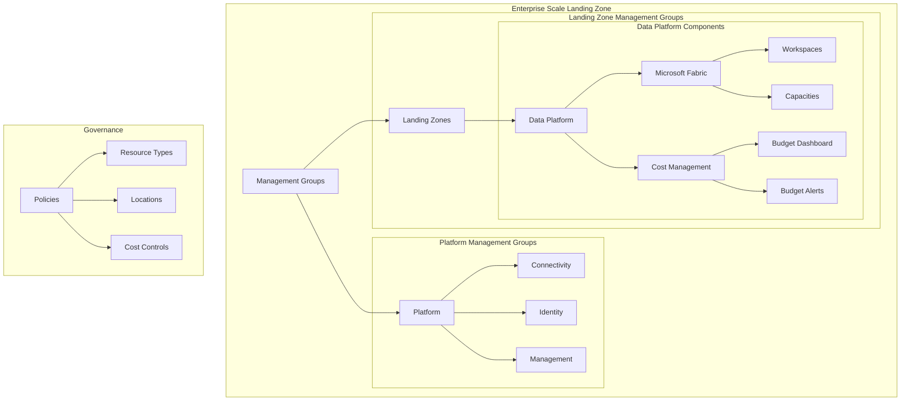

# Azure Landing Zone - Data Platform Deployment

This project implements a specialized Data Platform Landing Zone within the Azure Landing Zone framework, focusing on Microsoft Fabric workloads with integrated cost management and security controls.

## Architecture Overview

## Features
* *Microsoft Fabric Focus*: Specialized landing zone for Microsoft Fabric workloads
* *Cost Control*:
  * Integrated cost management dashboard
  * Multi-threshold budget alerts (50%, 75%, 90%, 100%)
  * Monthly budget tracking and reporting
* *Security & Governance*:
  * Strict resource type controls
  * Geographic boundary enforcement
  * Network security policies
* *Automated Deployment*:
  * Infrastructure as Code using Terraform
  * CI/CD pipelines for reliable deployments
  * Configuration validation

## Prerequisites
* Azure Subscription with Owner permissions
* Azure CLI (version 2.50.0 or higher)
* Terraform (version ~> 1.8)
* GitHub Actions (for CI/CD)

## Custodianship
| Role | Responsibility | Contact |
|------|----------------|---------|
| Platform Owner | Overall platform architecture and strategy | @platform-team |
| Security Owner | Security policies and compliance | @security-team |
| Cost Management | Budget monitoring and optimization | @finance-team |